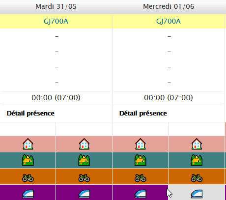
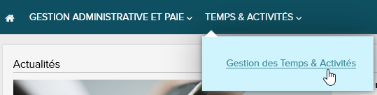
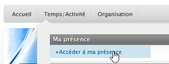
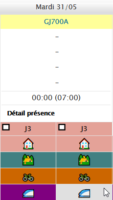

# D4ADP

Userscript improving [ADP](https://www.adp.com/)'s time tracking UX.

## Disclaimer

It has been developed on an ADP project using a specific configuration for the activities. A few tweaks are required to adapt to other projects.

It is provided "as is", without warranty of any kind.

It is not affiliated, associated, authorized, endorsed by, or in any way officially connected with [ADP](https://www.adp.com/).

## How add an event

Connect to [ADP](https://hr-services.fr.adp.com/portal-main/portal/#/home) then, on the top menu click on _Temps & Activités_ > _Gestion des Temps & Activités_.

On the new tab which opened, on the top menu click on _Temps/Activité_ > _Ma présence_ > _Accéder à ma présence_.

New rows are added on the weekly schedule to quickly add half a day (**left-click** on the icon) or a full day (**CTRL + right-click** on the icon) of : 
- 🏠 Remote (Regular)
- ⛺ Remote (Occasional)
- 🚲 RTT
- 🚄 CP

## How add remove daily event

Click on **CTRL + right-click** on one of the two icons (morning of afternoon) and it will delete all the daily events.

