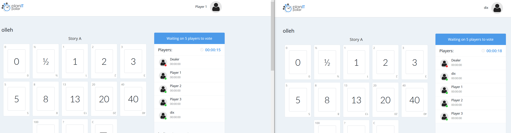

# PatrickBot

Userscript picking automatically a card on [PlanITpoker](https://www.planitpoker.com/) based on its popularity amongst the other players.

## How

Each time a _player_ vote is submitted/updated, computes the most popular one and vote for it. This way, the user is always in the _stronger_ team, maximizing their chances of _winning_ without having to justify their vote.

Example :
- Four players, one dealer
- Player 1 votes `Card 8`
- Results : 8=1
- PatrickBot computes that `Card 8` is the most popular; votes for it
- Player 2 votes `Card 2`
- Results : 2=1/8=1
- PatrickBot computes that `Card 2` is the most popular (in case of a tie, the smallest value wins); votes for it
- Player 3 votes `Card 8`
- Results : 2=1/8=2
- PatrickBot computes that `Card 8` is the most popular; votes for it
- Final results : 2=1/8=3

## Known limitations

At the moment, it has only been implemented for the `Scrum` cards of PlanITpoker. An update is required to support `Fibonacci`, `Sequential` and the other cards available on the application.

Also, not all the blocking status (during which trying to vote will raise an error message) have been tested and covered.

## Disclaimer

It was made as a funny POC only to demonstrate how it could be done.

If your team is using this tool to estimate the work, please do it seriously and vote yourself.
